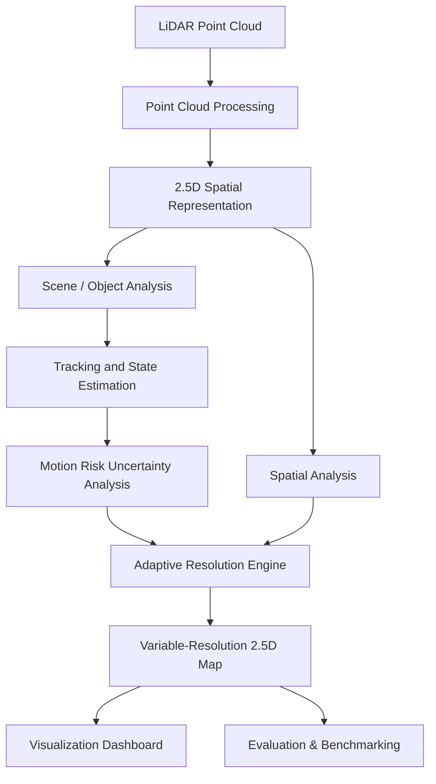

# DRISHTI

## Dynamic Resolution Intelligence System for Terrain & Imaging

### Adaptive Variable-Resolution 2.5D LiDAR Mapping for Dynamic Environment Perception

**Smart India Hackathon 2026 | Problem Statement: SIH26053**

> **DRISHTI is a software-based LiDAR perception and mapping system that dynamically allocates spatial resolution according to the relevance of different regions in a changing environment.**

Instead of representing the entire environment at a uniform level of detail, DRISHTI aims to concentrate computational and representational resources on regions that are more important for perception, while maintaining lower detail in less relevant regions.

---

## Table of Contents

* [1. Problem Overview](#1-problem-overview)
* [2. Proposed Solution](#2-proposed-solution)
* [3. What is 2.5D Mapping?](#3-what-is-25d-mapping)
* [4. Adaptive Resolution Concept](#4-adaptive-resolution-concept)
* [5. System Architecture](#5-system-architecture)
* [6. Core Components](#6-core-components)
* [7. Planned Advanced Features](#7-planned-advanced-features)
* [8. Technology Stack](#8-technology-stack)
* [9. Repository Structure](#9-repository-structure)
* [10. Example Scenario](#10-example-scenario)
* [11. Evaluation](#11-evaluation)
* [12. Development Roadmap](#12-development-roadmap)
* [13. Current Status](#13-current-status)
* [14. Team & Contributions](#14-team--contributions)
* [15. Responsible Development](#15-responsible-development)

---

# 1. Problem Overview

Conventional spatial mapping approaches may represent an environment using a fixed spatial resolution across the entire scene.

However, different regions of an environment do not necessarily have the same perception requirements.

For example:

* A distant static structure may only require coarse spatial representation.
* A nearby obstacle may require greater detail.
* A moving object may require frequent updates.
* A region associated with a potentially important interaction may require increased spatial resolution.

Processing every region at the same resolution can therefore result in unnecessary computational cost, particularly for real-time systems operating under limited compute, memory, latency, or power budgets.

### SIH26053

**Problem Statement:**
**Adaptive Variable Resolution 2.5D Lidar Mapping for Dynamic Environment Perception**

DRISHTI explores a software approach to this problem by dynamically determining the appropriate spatial resolution for different regions of a LiDAR-derived environment representation.

---

# 2. Proposed Solution

DRISHTI consists of a perception and mapping pipeline that:

1. Receives LiDAR point-cloud data.
2. Preprocesses the point cloud.
3. Generates a 2.5D spatial representation.
4. Identifies relevant objects or regions where applicable.
5. Estimates properties such as distance, motion, risk, and confidence.
6. Calculates a relevance score for regions of the environment.
7. Assigns different resolution levels according to that score.
8. Updates the resulting variable-resolution 2.5D representation.
9. Visualizes the map and the decisions made by the adaptive resolution system.

### Concept

```text
                    LiDAR Point Cloud
                           │
                           ▼
                  Point Cloud Processing
                           │
                           ▼
                    2.5D Representation
                           │
              ┌────────────┴────────────┐
              │                         │
              ▼                         ▼
       Scene / Object Analysis     Spatial Analysis
              │                         │
              └────────────┬────────────┘
                           ▼
                  Relevance Estimation
                           │
                           ▼
                Adaptive Resolution Engine
                           │
                           ▼
                Variable-Resolution Map
                           │
                           ▼
                 Visualization / Analysis
```

The key idea is that **resolution becomes a dynamic property of the map rather than a fixed global setting.**

---

# 3. What is 2.5D Mapping?

A full 3D representation preserves spatial information across the X, Y, and Z dimensions, potentially requiring substantial memory and computational resources.

A 2D representation simplifies the environment into a planar representation but can lose important elevation information.

A **2.5D representation** provides a compromise.

The environment is represented using a 2D spatial grid, while each cell stores one or more values describing the vertical structure or surface associated with that location.

Depending on the implementation, a cell may contain information such as:

* Height / elevation
* Minimum and maximum observed height
* Surface height
* Occupancy
* Point density
* Confidence
* Other derived spatial attributes

A simplified representation can therefore be viewed as:

```text
             Y
             ↑
       ┌─────┬─────┬─────┐
       │ h₁  │ h₂  │ h₃  │
       ├─────┼─────┼─────┤
       │ h₄  │ h₅  │ h₆  │
       ├─────┼─────┼─────┤
       │ h₇  │ h₈  │ h₉  │
       └─────┴─────┴─────┘
                → X
```

where each cell represents a spatial region and stores height/elevation-derived information.

The exact cell representation and stored attributes will be finalized during implementation and evaluation.

---

# 4. Adaptive Resolution Concept

The central component of DRISHTI is the **Adaptive Resolution Engine**.

Instead of assigning one resolution to the entire map, the system divides the environment into spatial regions and determines an appropriate resolution for each region.

### Example

```text
┌──────┬──────┬──────┬──────┬──────┐
│ LOW  │ LOW  │ LOW  │ MED  │ HIGH │
├──────┼──────┼──────┼──────┼──────┤
│ LOW  │ LOW  │ MED  │ HIGH │ HIGH │
├──────┼──────┼──────┼──────┼──────┤
│ LOW  │ MED  │ HIGH │ HIGH │ HIGH │
├──────┼──────┼──────┼──────┼──────┤
│ LOW  │ LOW  │ MED  │ MED  │ LOW  │
└──────┴──────┴──────┴──────┴──────┘
```

These levels are conceptual. Actual resolution values will be determined through experiments.

## Relevance Factors

The adaptive decision can consider multiple factors, including:

### Distance

Regions closer to the sensor may receive higher priority depending on the application.

### Semantic Importance

Different object or region categories may have different priorities.

For example, a pedestrian may require different treatment from a distant static structure.

### Motion

Dynamic regions may require more frequent updates or finer representation than static regions.

### Risk

Regions associated with potential interaction or collision may receive increased priority.

### Uncertainty

Regions with low confidence or ambiguous observations may be candidates for additional processing.

### Predicted Motion

The system may increase resolution in regions where a tracked object's future trajectory is expected to pass.

---

## Relevance Score

A conceptual relevance function can be represented as:

```text
R = f(D, S, M, K, U, P)
```

where:

* `D` = distance-related factor
* `S` = semantic importance
* `M` = motion factor
* `K` = risk factor
* `U` = uncertainty factor
* `P` = predicted-motion factor

A weighted formulation may subsequently be implemented:

```text
R = w₁D + w₂S + w₃M + w₄K + w₅U + w₆P
```

The weights and normalization strategy are **design parameters**, not fixed values at this stage.

The resulting score can then be mapped to resolution tiers:

```text
Relevance
    │
    ├── Low       → Coarse representation
    │
    ├── Medium    → Medium representation
    │
    ├── High      → Fine representation
    │
    └── Critical  → Maximum available detail
```

---

# 5. System Architecture



## Pipeline

### 1. LiDAR Input

Input may consist of:

* Recorded LiDAR point clouds
* Public datasets
* Synthetic/simulated point clouds
* Live sensor data, if available

### 2. Point Cloud Processing

Potential processing steps include:

* Noise filtering
* Outlier removal
* Ground segmentation
* Coordinate transformation
* Downsampling
* Spatial partitioning

### 3. 2.5D Representation

Processed point-cloud information is converted into the project's chosen 2.5D grid representation.

### 4. Scene / Object Analysis

Relevant objects or spatial regions may be identified using suitable perception methods.

### 5. Tracking

Objects observed across multiple frames can be associated to estimate their temporal state.

### 6. Motion / Risk / Uncertainty Analysis

The system estimates information that can influence the relevance of different regions.

### 7. Adaptive Resolution Engine

The engine determines which spatial regions should receive higher or lower resolution.

### 8. Variable-Resolution Map

The final representation contains spatial regions with different levels of detail.

### 9. Visualization

The dashboard allows users to inspect:

* The environment
* Resolution allocation
* Detected objects
* Object tracks
* Risk information
* System performance

### 10. Evaluation

The system is compared against a suitable uniform-resolution baseline.

---

# 6. Core Components

The initial implementation is organized around the following components.

## Point Cloud Processing

Responsible for:

* Input handling
* Preprocessing
* Filtering
* Spatial partitioning
* Point-cloud transformations

## 2.5D Mapping

Responsible for:

* Grid generation
* Height/elevation extraction
* Cell-level attributes
* Map updates

## Object / Scene Analysis

Responsible for identifying relevant objects or regions using the selected perception approach.

## Tracking

Responsible for maintaining object state across frames.

Possible state variables include:

* Position
* Velocity
* Direction
* Track confidence

## Adaptive Resolution Engine

The primary research/engineering component.

Responsible for:

* Relevance calculation
* Resolution selection
* Spatial resolution updates
* Temporal resolution updates, where applicable

## Risk & Uncertainty Analysis

Responsible for deriving additional information that can influence resolution allocation.

## Visualization

Responsible for displaying:

* 2.5D map
* Resolution tiers
* Objects
* Tracks
* Risk
* Performance metrics

---

# 7. Planned Advanced Features

The following features are **proposed extensions** and are not assumed to be implemented in the initial MVP.

### Predictive Resolution Allocation

Increase resolution not only where an object currently exists, but also in regions where its predicted trajectory is expected to move.

### Risk Heatmap

Display spatial risk levels across the environment.

```text
LOW       MEDIUM       HIGH

🟢 🟢 🟡 🟡 🔴
🟢 🟡 🟡 🔴 🔴
🟢 🟢 🟡 🔴 🔴
```

### Uncertainty-Aware Mapping

Increase processing priority for regions where perception confidence is low.

### Trajectory Prediction

Estimate short-term future positions of tracked dynamic objects.

### Explainable Resolution Decisions

Display why a region changed resolution.

Example:

```text
Resolution: HIGH

Reasons:
- Dynamic object detected
- Distance decreased
- Predicted path intersects region
- Risk score increased
```

### Computational Efficiency Dashboard

Compare adaptive processing with a uniform-resolution baseline using measured metrics such as:

* Processing time
* Number of processed points
* Memory usage
* Update rate
* CPU/GPU utilization

### Simulation Mode

Allow repeatable experiments using recorded or synthetic LiDAR scenes.

### What-If Simulation

Allow controlled changes to scenario parameters such as:

* Object position
* Object velocity
* Sensor noise
* Object density
* Resolution policy

### Short-Term Object Memory

Maintain temporal information about tracked objects across frames, including temporary loss of detection where supported by the tracking design.

---

# 8. Technology Stack

The technology stack is being selected based on implementation requirements and benchmark results.

| Layer                  | Current Direction                             |
| ---------------------- | --------------------------------------------- |
| Language               | Python                                        |
| Numerical Computing    | NumPy, SciPy                                  |
| Point Cloud Processing | Open3D / suitable point-cloud library         |
| Computer Vision        | OpenCV                                        |
| Deep Learning          | PyTorch                                       |
| Object Detection       | Model/framework to be evaluated               |
| Classical ML           | scikit-learn, where required                  |
| Backend                | FastAPI, if an API layer is required          |
| Visualization          | Streamlit / React / Three.js, to be evaluated |
| Testing                | pytest                                        |
| Version Control        | Git + GitHub                                  |

### Important

The technologies listed above are **implementation candidates**, not claims that every listed framework will be used in the final system.

Technology choices will be finalized after evaluating:

* Processing speed
* GPU/CPU requirements
* Ease of integration
* Visualization requirements
* Dataset compatibility
* Deployment constraints

---

# 9. Repository Structure

The repository is organized to keep the major system components modular.

```text
DRISHTI/
│
├── data/
│   ├── raw/
│   ├── processed/
│   └── samples/
│
├── src/
│   ├── ingestion/
│   │   ├── loader.py
│   │   └── preprocessing.py
│   │
│   ├── mapping/
│   │   ├── grid.py
│   │   ├── projection.py
│   │   └── map_update.py
│   │
│   ├── detection/
│   │   ├── detector.py
│   │   └── postprocess.py
│   │
│   ├── tracking/
│   │   ├── tracker.py
│   │   └── state_estimation.py
│   │
│   ├── analysis/
│   │   ├── motion.py
│   │   ├── risk.py
│   │   └── uncertainty.py
│   │
│   ├── resolution_engine/
│   │   ├── relevance.py
│   │   ├── policy.py
│   │   └── resolution.py
│   │
│   └── visualization/
│       └── dashboard.py
│
├── simulation/
│   ├── scenarios.py
│   └── generator.py
│
├── evaluation/
│   ├── metrics.py
│   ├── benchmark.py
│   └── experiments.py
│
├── tests/
│   ├── unit/
│   └── integration/
│
├── notebooks/
│
├── docs/
│   ├── architecture/
│   └── experiments/
│
├── requirements.txt
├── README.md
└── .gitignore
```

The structure may evolve as implementation progresses.

---

# 10. Example Scenario

## Urban Dynamic Environment

Consider a mobile platform operating in an urban environment.

The LiDAR sensor observes:

* Buildings
* Road surface
* Static infrastructure
* Pedestrians
* Vehicles

A conceptual resolution policy might behave as follows:

```text
Distant static structure
        ↓
     LOW RES

General surroundings
        ↓
   MEDIUM RES

Nearby dynamic object
        ↓
     HIGH RES

Potential interaction region
        ↓
   VERY HIGH RES
```

If a tracked pedestrian moves toward a region of interest, the system can increase the resolution of the relevant spatial area.

If the pedestrian moves away, the resolution can subsequently decrease.

This demonstrates the central principle:

> **Spatial detail should adapt to environmental relevance rather than remain uniformly fixed.**

The exact thresholds, resolution sizes, and scoring parameters will be determined experimentally.

---

# 11. Evaluation

A major objective of DRISHTI is to demonstrate that adaptive mapping can reduce unnecessary computation while maintaining useful perception quality.

The evaluation will therefore compare DRISHTI against an appropriate **uniform-resolution baseline** using the same input data and comparable processing conditions.

## Planned Metrics

### Computational Metrics

* Processing latency
* Frames / updates per second
* Number of points processed
* Memory consumption
* CPU utilization
* GPU utilization, where applicable

### Mapping Metrics

* Spatial representation quality
* Resolution allocation consistency
* Map update stability
* Preservation of relevant spatial detail

### Perception Metrics

Where applicable:

* Detection performance
* Tracking stability
* Object localization quality
* Confidence consistency

### Adaptive Policy Metrics

* Percentage of regions receiving each resolution tier
* Frequency of resolution changes
* Response time to dynamic events
* Priority given to relevant regions

## Baseline Comparison

The key experiment will compare:

```text
                    Same Input
                       │
              ┌────────┴────────┐
              │                 │
              ▼                 ▼
       Uniform Resolution   DRISHTI
              │                 │
              ▼                 ▼
          Metrics           Metrics
              │                 │
              └────────┬────────┘
                       ▼
                   Comparison
```

No performance numbers will be claimed until they have been experimentally measured.

---

# 12. Development Roadmap


## Phase 1 — Data & Point Cloud Pipeline

* Select suitable LiDAR datasets
* Implement input pipeline
* Preprocess point clouds
* Establish reproducible sample scenes

## Phase 2 — 2.5D Mapping

* Define grid representation
* Generate map from point clouds
* Implement map updates
* Validate representation

## Phase 3 — Adaptive Resolution

* Define spatial partitioning
* Implement relevance scoring
* Implement resolution tiers
* Validate resolution transitions

## Phase 4 — Tracking, Risk & Uncertainty

* Object tracking
* Motion estimation
* Risk estimation
* Uncertainty estimation

## Phase 5 — Visualization

* Interactive map
* Resolution overlay
* Object information
* Performance dashboard

## Phase 6 — Evaluation & Optimization

* Establish baseline
* Benchmark adaptive vs. uniform processing
* Measure computational cost
* Measure perception/mapping performance
* Optimize bottlenecks

## Phase 7 — Advanced Features

Potential additions:

* Predictive resolution
* Trajectory prediction
* Explainable resolution changes
* What-if simulation
* Multi-mode operation

---

# 13. Current Status

**Project Stage: Early Development**

### Completed / Established

* Problem understanding
* Initial system concept
* High-level architecture
* Modular repository design
* Initial feature specification

### In Development

* Point-cloud processing pipeline
* 2.5D representation design
* Module interfaces
* Adaptive resolution algorithm design

### Planned

* Object detection
* Tracking
* Risk and uncertainty analysis
* Interactive dashboard
* Simulation framework
* Benchmarking

### Not Yet Claimed

The project currently does **not** claim:

* Measured computational savings
* Specific FPS improvements
* Specific latency improvements
* Production-level perception accuracy
* Safety-critical reliability

These claims will only be added after reproducible experiments.

---

# 14. Team & Contributions

**Project:** DRISHTI
**Hackathon:** Smart India Hackathon 2026
**Problem Statement:** SIH26053

| Role                   | Responsibility                               | Member |
| ---------------------- | -------------------------------------------- | ------ |
| Team Lead              | Project coordination & overall direction     | TBD    |
| LiDAR / Mapping        | Point-cloud processing & 2.5D mapping        | TBD    |
| Perception / Detection | Object detection & scene understanding       | TBD    |
| Adaptive Resolution    | Relevance scoring & resolution policy        | TBD    |
| Tracking / Risk        | Tracking, motion & risk analysis             | TBD    |
| Integration / Systems  | Backend, integration, testing & benchmarking | TBD    |

## Contribution Workflow

Development follows a feature-branch workflow.

```text
main
  │
  └── development
        │
        ├── feature/lidar
        ├── feature/detection
        ├── feature/adaptive-resolution
        ├── feature/tracking
        ├── feature/visualization
        └── feature/integration
```

Contributors should:

1. Create a feature branch.
2. Make focused commits.
3. Test their changes locally.
4. Open a pull request.
5. Review integration issues before merging.
6. Avoid direct pushes to `main`.

The exact branch protection and review policy will be configured by the repository maintainers.

---

# 15. Responsible Development

DRISHTI is currently a **hackathon/research prototype**.

It is not a certified autonomous perception system and must not be treated as a production safety-critical system.

Any real-world deployment would require substantially more validation, including:

* Extensive dataset evaluation
* Sensor-specific validation
* Adverse-condition testing
* Failure-mode analysis
* Hardware/edge deployment testing
* Safety validation
* Independent verification

The system's risk scores and perception outputs are intended for research and demonstration purposes at the current stage.

---

## License

A project license will be added once the team's code ownership and release strategy have been finalized.

---

## Project Status

**🚧 Active Development**

DRISHTI is being developed as part of the **Smart India Hackathon 2026** challenge for **SIH26053: Adaptive Variable Resolution 2.5D Lidar Mapping for Dynamic Environment Perception**.

The repository will be updated as implementation, experiments, and evaluation progress.
