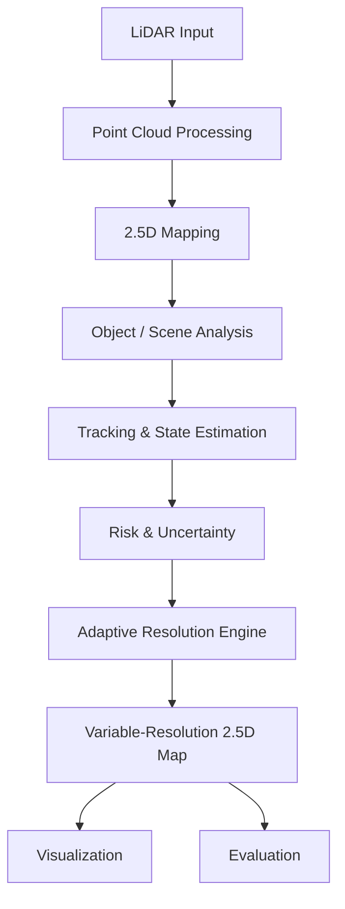

# DRISHTI

## Dynamic Resolution Intelligence System for Terrain & Imaging

### Adaptive Variable-Resolution 2.5D LiDAR Mapping for Dynamic Environment Perception

**Smart India Hackathon 2026 | Problem Statement: SIH26053**

> **DRISHTI is a software-based LiDAR perception and mapping system that dynamically allocates spatial resolution based on the relevance of different regions in a changing environment.**

Instead of processing the entire environment at a fixed resolution, DRISHTI aims to allocate more detail and computational resources to important regions while keeping less relevant regions at lower resolution.

---

## 📌 Problem

Traditional mapping approaches can process large parts of an environment at the same resolution, even when many regions are static or less relevant.

For real-time perception systems, this can lead to:

* Unnecessary computation
* Higher processing latency
* Increased memory usage
* Inefficient use of limited edge/embedded resources

**SIH26053** focuses on adaptive variable-resolution 2.5D LiDAR mapping for dynamic environment perception.

---

## 💡 Our Approach

DRISHTI analyzes LiDAR data and dynamically determines the resolution required for different spatial regions.

```text
LiDAR Point Cloud
       ↓
Point Cloud Processing
       ↓
2.5D Representation
       ↓
Object / Scene Analysis
       ↓
Motion + Risk + Uncertainty
       ↓
Adaptive Resolution Engine
       ↓
Variable-Resolution 2.5D Map
       ↓
Visualization & Evaluation
```

The resolution decision can consider:

* Distance
* Object/region importance
* Motion
* Risk
* Perception uncertainty
* Predicted trajectory

The goal is simple:

> **Process the environment intelligently instead of treating every region equally.**

---

## 🗺️ What is 2.5D Mapping?

A 2.5D map represents the environment using a 2D spatial grid while storing additional height/elevation information for each cell.

Compared with a full 3D representation, this can provide a lighter representation while retaining useful vertical information.

Example:

```text
┌─────┬─────┬─────┐
│ H₁  │ H₂  │ H₃  │
├─────┼─────┼─────┤
│ H₄  │ H₅  │ H₆  │
├─────┼─────┼─────┤
│ H₇  │ H₈  │ H₉  │
└─────┴─────┴─────┘
```

---

## ⚙️ Adaptive Resolution

Different regions can receive different resolution levels:

```text
Distant / Static Region     → LOW
General Environment         → MEDIUM
Nearby Dynamic Object       → HIGH
High-Risk Region            → VERY HIGH
```

A conceptual relevance score can be calculated using:

```text
R = f(Distance, Importance, Motion, Risk, Uncertainty, Prediction)
```

The exact weights and thresholds will be determined through experimentation.

---

## 🚀 Planned Features

### Core

* LiDAR point-cloud processing
* 2.5D map generation
* Adaptive spatial resolution
* Object detection
* Object tracking
* Motion and risk analysis
* Interactive visualization

### Advanced

* Predictive resolution allocation
* Trajectory prediction
* Risk heatmap
* Uncertainty-aware mapping
* Explainable resolution decisions
* Computational-efficiency benchmarking
* Simulation / What-if scenarios

Advanced features will be implemented progressively and are not all part of the initial MVP.

---

## 🏗️ Architecture



---

## 🛠️ Technology Stack

| Layer               | Technologies                 |
| ------------------- | ---------------------------- |
| Language            | Python                       |
| Numerical Computing | NumPy, SciPy                 |
| Point Clouds        | Open3D                       |
| Computer Vision     | OpenCV                       |
| Deep Learning       | PyTorch                      |
| Detection           | Model to be evaluated        |
| Backend             | FastAPI, if required         |
| Visualization       | Streamlit / React / Three.js |
| Testing             | pytest                       |
| Version Control     | Git + GitHub                 |

Technology choices may change based on performance and integration testing.

---

## 📁 Repository Structure

```text
DRISHTI/
├── data/
├── src/
│   ├── ingestion/
│   ├── mapping/
│   ├── detection/
│   ├── tracking/
│   ├── analysis/
│   ├── resolution_engine/
│   └── visualization/
├── simulation/
├── evaluation/
├── tests/
├── notebooks/
├── docs/
├── requirements.txt
└── README.md
```

---

## 📊 Evaluation

DRISHTI will be evaluated against a suitable **uniform-resolution baseline** using the same input data.

Planned metrics include:

* Processing latency
* Update rate / FPS
* Number of processed points
* Memory usage
* CPU/GPU utilization
* Detection/tracking performance
* Resolution allocation behavior
* Map quality

No performance numbers will be claimed until they are experimentally measured.

---

## 🗓️ Development Roadmap

| Phase | Focus                           |
| ----- | ------------------------------- |
| 1     | LiDAR processing + 2.5D mapping |
| 2     | Adaptive resolution engine      |
| 3     | Detection + tracking + risk     |
| 4     | Visualization dashboard         |
| 5     | Benchmarking + optimization     |
| 6     | Advanced features               |

---

## 👥 Team

| Role                  | Responsibility                               |
| --------------------- | -------------------------------------------- |
| Team Lead             | Coordination & overall direction             |
| LiDAR / Mapping       | Point-cloud processing & 2.5D mapping        |
| Perception            | Object detection                             |
| Adaptive Resolution   | Relevance scoring & resolution engine        |
| Tracking / Risk       | Tracking, motion & risk                      |
| Integration / Systems | Backend, integration, testing & benchmarking |

---

## 📌 Current Status

**🚧 Active Development**

Current focus:

* System architecture
* Point-cloud pipeline
* 2.5D representation
* Adaptive resolution design
* Module integration

Performance benchmarks and advanced features will be added as they are implemented and validated.

---

## ⚠️ Responsible Development

DRISHTI is currently a **hackathon/research prototype** and is not a certified safety-critical system.

Any real-world deployment would require extensive testing, validation, hardware evaluation, and independent safety verification.

---

## License

License and release strategy will be finalized by the team.

---

**DRISHTI — Making LiDAR perception adaptive, efficient, and context-aware.**
